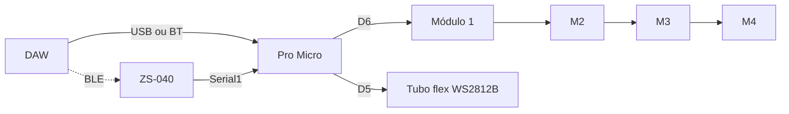

# Arquitetura — v0

## Papéis

| Peça | MCU? | Função |
|------|------|--------|
| **Cabeça** | Pro Micro + **ZS-040** | MIDI USB ou BT → pixels WS2812B |
| **Módulo 1–4** | Nenhum | 1 LED RGB + pass-through cabos |
| **Tubo flex** | Nenhum | Fita WS2812B em tubo silicone (muitos pixels) |
| **Fonte 5V** | — | Alimentação (10A com tubo 4m) |
| **ZS-040** | BLE UART | MIDI sem fio → Serial1 — [19-ZS-040.md](19-ZS-040.md) |

Não há ESP32, RS-485 nem decoder nos módulos na v0.

## Fluxo de dados



- Protocolo WS2812B: **endereço na posição** da cadeia (0, 1, 2, 3)
- Firmware trata `modules[0]`…`modules[3]` no FastLED

## Cabeça (Pro Micro)

| Item | Especificação |
|------|----------------|
| Placa | SparkFun Pro Micro 5V / Arduino Leonardo |
| USB | MIDI nativo (ATmega32U4) |
| Data módulos | **Pin 6** (`MODULE_PIN`) |
| Data tubo | **Pin 5** (`TUBE_PIN`) |
| Firmware | `firmware/promicro-4mod/promicro-4mod.ino` |

### Responsabilidades

1. Receber MIDI (CC, notas, Program Change)
2. Manter cor RGB de cada módulo
3. Atualizar cadeia WS2812B (`FastLED.show()`)

## Módulo (repetível × 4)

```
     IN                          OUT
  5V ──┬── VCC LED ──┬── 5V
 GND ──┴── GND LED ──┴── GND
DATA ───── DIN    DOUT ─── DATA
```

| LED na cadeia | Índice firmware | Nota MIDI |
|---------------|-----------------|-----------|
| Módulo 1 (primeiro) | 0 | C3 (60) |
| Módulo 2 | 1 | D3 (61) |
| Módulo 3 | 2 | E3 (62) |
| Módulo 4 (último) | 3 | F3 (63) |

## Alimentação

- **5V** e **GND** em paralelo em todos os módulos (não passam pelo Pro Micro para os LEDs)
- Pro Micro: VCC da mesma fonte 5V ou USB só para programar

## Expansão

| Mudança | Esforço |
|---------|---------|
| Mais de 4 módulos | Alterar `NUM_MODULES` + fonte maior |
| Módulos físicos separados | Mesma cadeia DATA |
| v1 (24V, 10W) | Nova Cabeça + novos módulos — [v1/README.md](v1/README.md) |

## Topologia física

```
        [Mod1]──[Mod2]──[Mod3]──[Mod4]
           ▲
      [Cabeça Medusa: Pro Micro + XLR MOD/TUBO + fonte 5V]
```

Detalhes da caixa cabeça: [17-CABECA-MEDUSA.md](17-CABECA-MEDUSA.md).

Splits em T **não** aplicam na v0 — uma única cadeia DATA.
