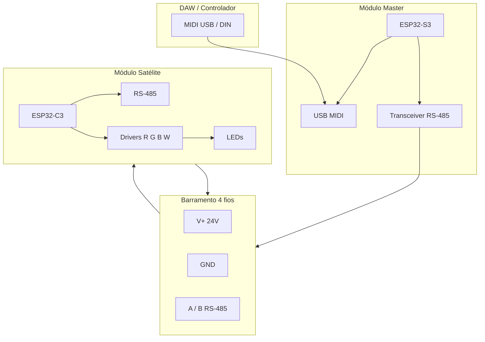

# Arquitetura modular

## Camadas do sistema



## Papéis

### Módulo Master (único)

- **MCU:** ESP32-S3 (USB nativo, bom para MIDI USB).
- **Funções:**
  - Receber MIDI (notas, CC, Program Change).
  - Manter tabela de mapeamento (canal MIDI → módulo → cor).
  - Enviar frames no RS-485 (broadcast ou endereçado).
  - Opcional: portal web para configuração Wi‑Fi / Art-Net futuro.

### Módulo Satélite (repetível)

- **MCU:** ESP32-C3 (barato, suficiente para PWM + RS-485).
- **Funções:**
  - Endereço fixo (DIP switch, solder jumper ou config via master).
  - PWM 12–16 kHz em 3–4 GPIOs → MOSFETs.
  - Repetir sinal RS-485 (hardware já faz pass-through elétrico no barramento).
  - Pass-through de **24 V** e **GND** (não regenerar energia).

### Por que RS-485 e não I2C / Wi‑Fi only?

| Barramento | Alcance | Cabo comum | Adequação palco |
|------------|---------|------------|-----------------|
| I2C | < 1 m | 4 fios | Ruim (ruído, comprimento) |
| Wi‑Fi mesh | ~30 m RF | Wi‑Fi | OK backup; latência/jitter em show |
| **RS-485** | **até 100 m+** | **par trançado + alimentação** | **Ideal para cabo de módulo** |
| DMX512 | 500 m | XLR 3 pinos | Padrão profissional (fase 2) |

## Conectores por módulo

Cada módulo expõe **dois conectores idênticos** (IN e OUT) com pinagem fixa:

| Pino | Sinal | Notas |
|------|-------|-------|
| 1 | V+ 24 V | Fusível local 1–2 A |
| 2 | GND | Referência comum |
| 3 | RS-485 A | Par trançado com B |
| 4 | RS-485 B | |

**Opcional pin 5:** shield / chassi (ligar GND em um ponto só na fonte).

### Conector mecânico sugerido

| Uso | Opção barata | Opção robusta |
|-----|--------------|---------------|
| Protótipo | XT30 (par) + RJ45 (dados only) | — |
| Montagem | **GX16-4** ou **M16 4 pinos** | Amphenol LTW |

Manter **mesma pinagem** em todos os módulos evita cabos “cross”.

## Endereçamento

- **8 módulos:** 3 bits DIP → endereço 1–7 (0 = broadcast desligado).
- **12+ módulos:** endereço em EEPROM via master na primeira boot.
- Protocolo simples proposto (ver [05-MIDI-DAW.md](05-MIDI-DAW.md)):

```
Frame: [SYNC][ADDR][CMD][R][G][B][W][CRC]
SYNC = 0xAA
CMD  = 0x01 SET_RGBW, 0x02 FADE, 0x10 PING
```

## Variante: master separado

Se preferir que o primeiro módulo de luz seja igual aos outros:

```
[Fonte]──[Caixa Master só ESP32+RS485]──[Mód1]──[Mód2]──...
              ▲
           USB MIDI
```

Vantagem: master não compete por dissipação com LEDs.

## Variante mínima (1 módulo, sem barramento)

Para validar conceito:

- 1× ESP32-S3 + 3× MOSFET + 3× LED 3 W.
- MIDI USB direto, sem RS-485.
- Evolui para satélite depois copiando firmware e adicionando transceiver.

## Split em T (sua topologia)

O barramento **não exige** que todos os módulos estejam numa única linha elétrica longa:

```
                    ┌──► Mód 5
                    ├──► Mód 6
Tronco: M1─M2─M3─M4┤
                    ├──► Mód 7
                    └──► Mód 8

Ramo: M4─M9─M10─M11─M12
```

**Regras:**

1. **RS-485:** cada split é uma derivação do par A/B; evitar “estrela” com mais de 2 derivações sem repeater — para palco pequeno (< 8 módulos) costuma funcionar.
2. **24 V:** ramos longos ou muitos módulos num ramo → **injetar V+** de novo a partir da fonte (ver [04-ALIMENTACAO.md](04-ALIMENTACAO.md)).
3. **GND:** sempre retornar à fonte; não criar loops de terra com shield em vários pontos.

## Tamanho físico do módulo (alvo)

| Versão | LEDs | Dimensão alvo | Uso |
|--------|------|---------------|-----|
| Spot-S | 3× 3 W | 80×80×40 mm | Cabeça de luz, side fill |
| Spot-M | 3× 10 W | 120×120×50 mm | Front wash pequeno |
| Bar | tira 12 V RGB + MOSFET | perfil alumínio 0,5 m | Wash linear |

Começar pelo **Spot-S**.
