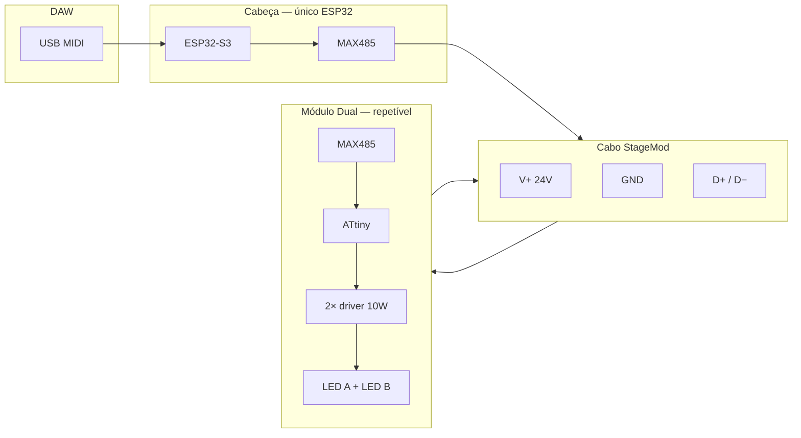

# Arquitetura modular — cabeça única

## Princípio

| Peça | Inteligência | Função |
|------|--------------|--------|
| **Cabeça** | ESP32-S3 | MIDI, presets, config de módulos, mestre RS-485 |
| **Módulo Dual** | ATtiny (decoder) | 2× PWM → 2× driver 10 W → 2× LED |
| **Cabo StageMod** | — | 24 V + GND + RS-485 no mesmo cabo |

Não há ESP32 nos módulos. Isso reduz custo, calor e complexidade em cada ponto de luz.

## Diagrama do sistema



## Cabeça (Head Unit)

Caixa separada na mesa ou no rack — **não** compartilha dissipação com LEDs.

| Bloco | Componente |
|-------|------------|
| MCU | ESP32-S3 DevKit ou módulo USB |
| Barramento | MAX485 (half-duplex) |
| Alimentação local | Buck 24→5 V (fonte da Cabeça pode ser a mesma 24 V do rig) |
| Interface | USB MIDI para DAW |
| Armazenamento | `modules.json` em SPIFFS/LittleFS |

Saída: **1× conector StageMod OUT** → primeiro módulo (ou distro + tronco).

### Funções firmware Cabeça

1. Receber MIDI (notas, CC, Program Change).
2. Resolver perfil de cada módulo (`ch_a`, `ch_b` por addr).
3. Enviar frames `SET_LEVELS` no RS-485.
4. Watchdog: blackout se USB desconectado (configurável).
5. (Futuro) Portal web para editar `modules.json`.

## Módulo Dual (satélite passivo)

Ver detalhes em [10-MODULO-DUAL.md](10-MODULO-DUAL.md).

Resumo:

- **2 canais × 10 W** — padrão warm white + vermelho.
- PCB **universal** — outras cores = trocar star LED + config na Cabeça.
- Endereço: **DIP switch** (3–4 bits).
- Conectores: **IN** + **OUT** StageMod (pass-through V+, GND, D+, D−).

## Cabo StageMod

Especificação completa: [09-CABO-STAGEMOD.md](09-CABO-STAGEMOD.md).

| Via | Função |
|-----|--------|
| 1 | V+ 24 V |
| 2 | GND |
| 3 | D+ (RS-485 A) |
| 4 | D− (RS-485 B) |
| 5 | Shield (malha) |

Conector v1: **GX16-5** (aviação M16, 5 pinos).

## Por que RS-485 no cabo de palco

| Barramento | Cabeça única + módulos simples |
|------------|-------------------------------|
| I2C | Alcance curto, ruído |
| DMX512 | Viável (fase futura como modo compatível) |
| **RS-485** | **Já no Cabo StageMod**, barato, 100 m+ |
| Wi‑Fi por módulo | Descartado (sem ESP no módulo) |

## Endereçamento e configuração

| Camada | Onde | O quê |
|--------|------|-------|
| Física | DIP no módulo | Addr 1–15 |
| Lógica | Cabeça `modules.json` | Tipo cor ch A, ch B |
| Física LED | Soquete star | LED 10 W correspondente |

Exemplos de perfis: [11-CONFIGURACAO-MODULOS.md](11-CONFIGURACAO-MODULOS.md).

## Split em T

```
[Cabeça]═══[M1]═══[M2]═══[M3]═══[M4]═══ ...
                              ├════ [M5]
                              ├════ [M6]
                              └════ [M9]═══[M10]═══ ...
```

- Adaptador **T-StageMod** ou distro com várias saídas GX16.
- RS-485 em derivação: OK até ~12 módulos em palco pequeno.
- Ramo com muitos módulos 10 W → **injeção V+** da fonte (ver [04-ALIMENTACAO.md](04-ALIMENTACAO.md)).

## Dimensionamento rápido

| Módulos | Potência LED máx. | Corrente 24 V (barramento)* | Fonte |
|---------|-------------------|----------------------------|-------|
| 4 | 80 W | ~4 A | 24 V / 6 A |
| 8 | 160 W | ~8 A | 24 V / 10 A |
| 12 | 240 W | ~12 A | 24 V / 15 A |

\* Com drivers buck eficientes; cada módulo ~1–1,2 A @ 24 V em full blast.

## Tamanho físico alvo

| Peça | Dimensão alvo |
|------|---------------|
| Cabeça | Caixa 120×80×40 mm |
| Módulo Dual | 100×100×45 mm (heatsink integrado) |
| Cabo patch | 0,3–0,8 m entre módulos |
