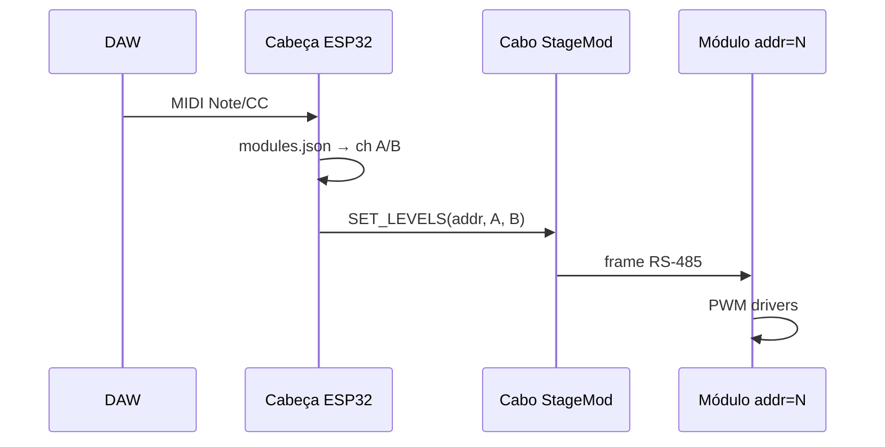

# MIDI e integração com DAW

Toda lógica MIDI vive na **Cabeça** (único ESP32). Módulos só recebem níveis 0–255 nos canais A e B.

## Fluxo



## Protocolo RS-485 (v2 — 2 canais)

| Byte | Campo | Descrição |
|------|-------|-----------|
| 0 | SYNC | 0xAA |
| 1 | ADDR | 1–127 módulo; 0xFF broadcast |
| 2 | CMD | Ver tabela |
| 3 | CH_A | 0–255 |
| 4 | CH_B | 0–255 |
| 5 | CRC8 | XOR bytes 0–4 |

| CMD | Valor | Ação |
|-----|-------|------|
| SET_LEVELS | 0x01 | Aplica A e B |
| FADE | 0x02 | + uint16 ms |
| BLACKOUT | 0x03 | A=0, B=0 (broadcast) |
| PING | 0x10 | Módulo responde PONG |

Baud: **115200** 8N1 half-duplex.

## Mapeamento MIDI

### Modo Performance (por cor semântica)

Acende **todos os canais** configurados com aquele tipo em `modules.json`:

| Nota | Tipo | Efeito |
|------|------|--------|
| C3 | red | Todos `ch_* == red` |
| D3 | warm_white | Todos WW |
| E3 | amber | Todos amber |
| G3 | — | Blackout |

Velocity → 0–127 → escala 0–255 no barramento.

### Modo Técnico (por módulo)

| CC | Função |
|----|--------|
| CC 20 | Selecionar addr 1–16 |
| CC 21 | Nível ch A do addr selecionado |
| CC 22 | Nível ch B do addr selecionado |
| CC 7 | Master dimmer (todos os módulos) |

### Program Change — presets

| PC | Preset exemplo |
|----|----------------|
| 0 | Blackout |
| 1 | Warm wash (WW 100 % onde existir) |
| 2 | Red wash |
| 3 | WW+red blend (WW 40 %, red 80 % nos módulos WW+R) |

## Exemplo `modules.json`

```json
{
  "midi_channel": 1,
  "modules": [
    { "addr": 1, "ch_a": "warm_white", "ch_b": "red" },
    { "addr": 2, "ch_a": "warm_white", "ch_b": "warm_white" },
    { "addr": 3, "ch_a": "red", "ch_b": "amber" }
  ]
}
```

Lógica Cabeça ao receber “warm_white” note:

```text
para cada módulo em modules:
  se ch_a == warm_white → enviar CH_A com nível
  se ch_b == warm_white → enviar CH_B com nível
```

## DAW — configuração rápida

**Reaper:** Preferences → MIDI → habilitar ESP USB → track com hardware MIDI out.

**Ableton:** Preferences → Link/MIDI → Track On no dispositivo.

Latência típica USB MIDI: 1–3 ms + 1 frame RS-485 (~1 ms).

## Watchdog

| Evento | Ação padrão |
|--------|-------------|
| USB MIDI desconectado 2 s | BLACKOUT broadcast |
| Módulo não responde PING | Log serial; UI futura marca offline |
| Nota de pânico (G9) | BLACKOUT imediato |

## Evolução futura

- MIDI DIN IN na Cabeça (6N138).
- Emulação DMX OUT (Cabeça como conversor MIDI→DMX para outros fixtures).
- RTP-MIDI via Wi‑Fi **só na Cabeça** (módulos inalterados).
