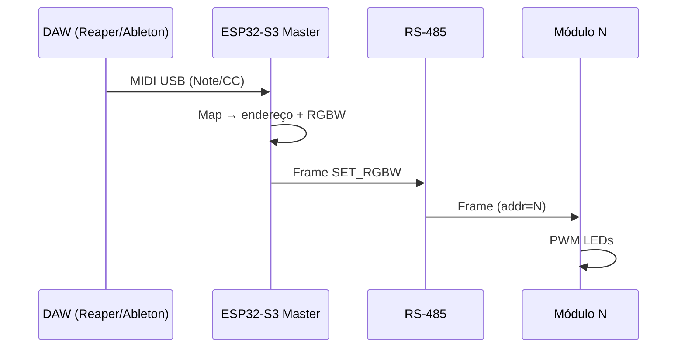

# MIDI e integração com DAW

## Fluxo de controle

## Interfaces MIDI suportadas (fases)

| Fase | Interface | Hardware |
|------|-----------|----------|
| **1** | **USB MIDI** | ESP32-S3 nativo |
| 2 | MIDI DIN IN (opcional) | 6N138 + UART |
| 3 | RTP-MIDI / Wi‑Fi | ESP-NOW ou UDP |
| 4 | Art-Net / DMX out | Conversor software no master |

Para palco com laptop na mesa: **USB MIDI é suficiente** e tem menor latência que Wi‑Fi.

## Mapeamento sugerido (padrão firmware)

### Modo A — Notas por módulo

| Nota MIDI | Módulo | Cor |
|-----------|--------|-----|
| C3 (60) | 1 | Vermelho 100 % |
| C#3 | 1 | Verde 100 % |
| D3 | 1 | Azul 100 % |
| D#3 | 1 | Branco (WW ou RGB mix) |
| E3 | 2 | Vermelho |
| … | … | … |

Velocity = brilho 0–127 → 0–100 % PWM.

### Modo B — CC por canal (mais flexível para DAW)

| CC | Função |
|----|--------|
| CC 1 | Módulo selecionado (1–127) |
| CC 2 | Red |
| CC 3 | Green |
| CC 4 | Blue |
| CC 5 | White |
| CC 6 | Master dimmer (todos) |

Canal MIDI configurável (default canal 1).

### Modo C — Program Change = presets

| PC | Preset |
|----|--------|
| 0 | Blackout |
| 1 | Warm wash |
| 2 | Cool wash |
| 3 | Red full |
| … | Salvos em flash do master |

## Configuração na DAW

### Reaper

1. Preferences → MIDI Devices → habilitar dispositivo USB do ESP.
2. Criar track com **MIDI hardware output** para o ESP.
3. Clip MIDI ou control surface com knobs mapeados para CC 2–5.

### Ableton Live

1. Preferences → Link/MIDI → Track On no ESP.
2. MIDI mapping mode: mapear knobs para CC.

### Latência esperada

| Trecho | Tempo típico |
|--------|--------------|
| USB MIDI | 1–3 ms |
| Master → RS-485 | < 1 ms |
| PWM update | 1 frame (~20 ms se 50 Hz DMX-like) |

Para sync musical apertado, enviar clock MIDI opcional (fase 2).

## Protocolo RS-485 (rascunho)

| Byte | Nome | Descrição |
|------|------|-----------|
| 0 | SYNC | 0xAA |
| 1 | ADDR | 0=broadcast, 1–127=módulo |
| 2 | CMD | Ver tabela |
| 3 | R | 0–255 |
| 4 | G | 0–255 |
| 5 | B | 0–255 |
| 6 | W | 0–255 |
| 7 | CRC8 | XOR bytes 0–6 |

| CMD | Valor | Ação |
|-----|-------|------|
| SET_RGBW | 0x01 | Aplica cor imediata |
| FADE | 0x02 | + bytes tempo ms |
| BLACKOUT | 0x03 | Tudo zero |
| PING | 0x10 | Resposta PONG com ADDR |

Baud rate: **115200** 8N1 half-duplex.

## Bibliotecas firmware (ESP-IDF / Arduino)

| Função | Biblioteca |
|--------|------------|
| USB MIDI | `Adafruit TinyUSB` / `Control Surface` (Arduino) |
| MIDI parsing | `FortySevenEffects MIDI Library` |
| RS-485 | UART nativo + controle DE pin |
| PWM | `ledc` ESP-IDF ou `analogWrite` Arduino |

## Projetos open source de referência

| Projeto | O que reutilizar |
|---------|------------------|
| [color-spray / arduino-midi-argb-dmx](https://github.com/dcooperdalrymple/arduino-midi-argb-dmx) | Mapeamento MIDI → RGB, MOSFET |
| [RLCV3](https://github.com/nksb92/rlcv3) | Perfis PWM + Art-Net (ideias) |
| [LightSync-MIDI](https://github.com/Yogarathinam/LightSync-MIDI) | Sync teclado → luz (efeitos) |

StageMod difere por ser **modular RS-485** e **LED de potência discreto**, não fita WS2812.

## Segurança operacional

- **Blackout MIDI:** PC 0 ou nota dedicada (ex. G9) → todos módulos OFF.
- Watchdog no satélite: sem frame do master por 2 s → fade to black.
- Limite de PWM máximo configurável (evitar LED sempre 100 % termicamente).
