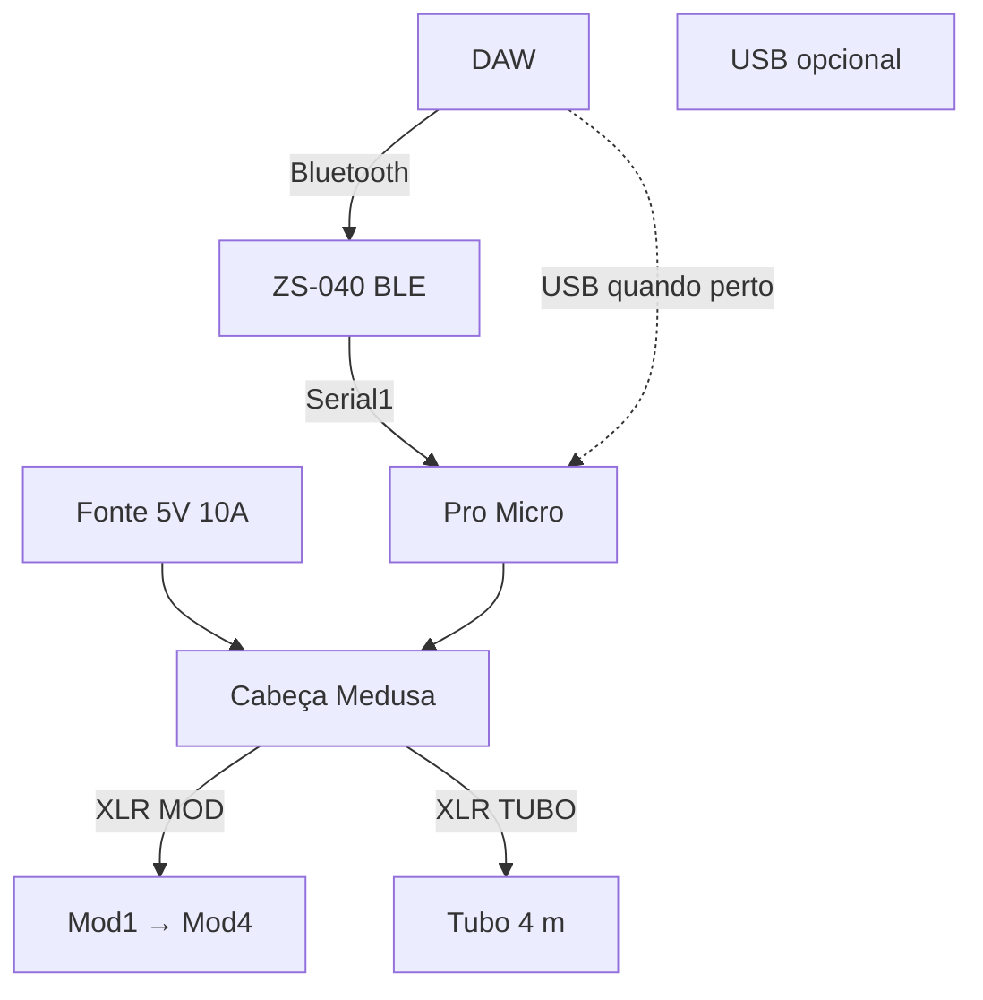

# Cabeça Medusa — Pro Micro + ZS-040

A **Medusa** é a caixa da cabeça do StageMod. Dentro da caixa há **apenas**:

| Peça | Função |
|------|--------|
| **Pro Micro** | Pixels (D5/D6), MIDI **USB** e **Serial1** (ZS-040) |
| **ZS-040** | Bluetooth → UART → Pro Micro |
| **Passivos / bornes / XLR** | 5 V, GND, saídas módulos e tubo |

Não há ESP-01 nem segundo MCU — só **Pro Micro + ZS-040**.

## Dois modos de MIDI (sem trocar firmware)

| Modo | Conexão | Quando |
|------|---------|--------|
| **Sem fio** | DAW → BT → ZS-040 → Serial1 | Palco, cabeça longe do PC |
| **USB** | DAW → USB → Pro Micro | Cabeça perto do notebook; menor latência |

Ambos podem ficar **habilitados** no firmware; na DAW use **só um** caminho por vez.

Detalhes e latência: [18-WIRELESS-MIDI.md](18-WIRELESS-MIDI.md).

## Função

| Entrada | Saídas |
|---------|--------|
| Fonte **5V 10A** (bornes) | **MOD** — D6 + 5V + GND |
| — | **TUBO** — D5 + 5V + GND |
| — | **INJ** (opc.) — só 5V + GND |
| **DAW** (Bluetooth) | ZS-040 → Serial1 |
| **USB micro** | Pro Micro — programação + MIDI com cabo |

Pinagem XLR: [16-XLR-CONECTORES.md](16-XLR-CONECTORES.md).

## Vista geral

```
                    ┌─────────────────────────────────────┐
   [Fonte 5V 10A]──►│  PWR IN (+ / −)                     │
                    │  ┌──────────┐    ┌─────────┐        │
   [DAW BT]─────────│  │ ZS-040   │UART│Pro Micro│◄──USB (opc.)
                    │  │ (5V*)    ├───►│ Serial1 │        │
                    │  └──────────┘    └────┬────┘        │
                    │    D6 ──[470Ω]──► XLR MOD           ├──► Mod1…
                    │    D5 ──[470Ω]──► XLR TUBO          ├──► tubo
                    │    5V/GND ───────► XLR INJ          │
                    └─────────────────────────────────────┘
                    * VCC 5V se o breakout permitir; senão 3,3 V
```



## Painel

```
┌──────────────────────────────────────────┐
│  STAGEMOD v0          [USB micro]        │
│   (MOD)  (TUBO)  (INJ)                   │
│     ○      ○       ○                     │
│  [−]  [+]   bornes 5V                    │
└──────────────────────────────────────────┘
```

## Esquema elétrico interno

```
        PWR IN (+) ──┬──► VCC Pro Micro (5V)
                     │
                     ├──► VCC ZS-040 (5V no breakout, ou 3V3 via AMS1117)
                     │
                [1000µF]
                     │
        PWR IN (−) ──┴── GND bus

        ZS TX ───────────────► Pro Micro RX (D0 / Serial1)
        Pro Micro TX (D1) ───► ZS RX  (divisor se 3V3)

        D6/D5 ──[470Ω]──► XLR MOD / TUBO
```

## BOM da Medusa

| Qty | Item | Notas |
|-----|------|--------|
| 1 | Pro Micro 5V 32U4 | Já tem |
| 1 | **ZS-040** (BLE UART) | Breakout com **entrada 5 V** de preferência |
| 0–1 | AMS1117-3.3 | Só se o seu ZS-040 for **3,3 V** estrito |
| 1 | Caixa ABS | USB + XLR |
| 2–3 | XLR fêmea painel | MOD, TUBO, INJ |
| 1 | Bornes entrada | Fonte 10 A |
| 2 | 470 Ω | D5, D6 |
| 1 | 1000 µF 16 V | Barramento 5 V |
| 1 | USB micro painel | Pro Micro |
| — | Divisor 1k/2k | TX Pro Micro → RX ZS (se necessário) |

## Firmware

| Peça | Onde |
|------|------|
| Pro Micro | `promicro-4mod.ino` — `ENABLE_USB_MIDI 1`, `ENABLE_SERIAL_MIDI 1` |
| ZS-040 | Transparente; configurar **AT+BAUD4** (115200) uma vez |

## Ordem de montagem

1. ZS-040 em adaptador USB: testar `AT`, subir baud, parear no PC.
2. Soldar UART ao Pro Micro; upload firmware.
3. Barramento 5 V + XLR; teste MOD com **BT** e depois com **USB**.

## Referências

- [18-WIRELESS-MIDI.md](18-WIRELESS-MIDI.md)
- [16-XLR-CONECTORES.md](16-XLR-CONECTORES.md)
- [07-CABLAGEM.md](07-CABLAGEM.md)
