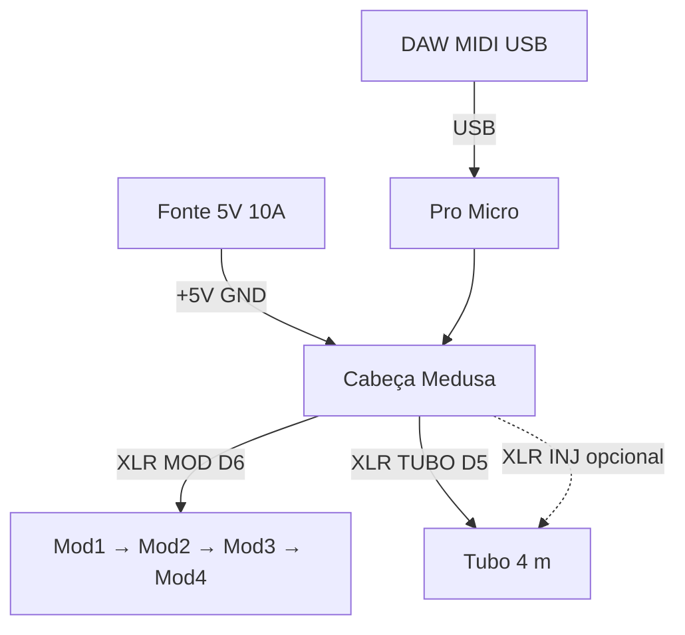

# Cabeça Medusa — Pro Micro

A **Medusa** é a caixa da **cabeça** do StageMod: um **Pro Micro** + distribuição de **5V/GND** + várias **saídas XLR** (“tentáculos”) para ligar **módulos** e **tubo** sem abrir o rig a cada montagem.

## Função

| Entrada | Saídas (tentáculos) |
|---------|---------------------|
| Fonte **5V 10A** (bornes) | **MOD** — DATA D6 + 5V + GND → cadeia dos 4 módulos |
| USB do Pro Micro (MIDI) | **TUBO** — DATA D5 + 5V + GND → tubo neon |
| — | **INJ** (opcional) — só **5V + GND** → injeção no meio do tubo 4 m |

Pinagem XLR: [16-XLR-CONECTORES.md](16-XLR-CONECTORES.md) (1=GND, 2=+5V, 3=DATA).

## Vista geral

```
                    ┌─────────────────────────────────────┐
   [Fonte 5V 10A]──►│  PWR IN (+ / −)                     │
                    │         ┌──────────┐                │
   [DAW USB]────────┼────────►│ Pro Micro │               │
                    │         └─────┬────┘                │
                    │    D6 ──[470Ω]──► XLR MOD  (fêmea)  ├──► cabo → Mod1…
                    │    D5 ──[470Ω]──► XLR TUBO (fêmea)  ├──► cabo → tubo
                    │    5V/GND bus ─────► XLR INJ (opc.) ├──► só alimentação
                    └─────────────────────────────────────┘
                              CABEÇA MEDUSA
```



## Painel frontal (sugestão)

Vista de frente da caixa (ex.: ABS **120×80×40 mm** ou maior se couber confortável):

```
┌──────────────────────────────────────────┐
│  STAGEMOD v0          [USB micro]        │
│                                          │
│   (PWR)  (MOD)  (TUBO)  (INJ)            │
│    ○      ○       ○       ○   ← XLR fêmea painel
│                                          │
│  [−]  [+]   bornes fonte 5V              │
└──────────────────────────────────────────┘
```

| Conector | Etiqueta | Pino 3 |
|----------|----------|--------|
| XLR 1 | **MOD** | D6 (via 470Ω) |
| XLR 2 | **TUBO** | D5 (via 470Ω) |
| XLR 3 | **INJ** | **NC** (não ligar DATA) |
| Bornes | **PWR** | Entrada da fonte SMPS |

**INJ:** pinos 1 e 2 iguais aos outros XLR (GND e +5V do barramento). Pino 3 vazio ou sem conexão — cabo até o meio do tubo só para reforçar alimentação.

## Esquema elétrico interno

```
        PWR IN (+) ─────┬───────────────────────────┬── VCC Pro Micro
                        │                           │
                   [1000µF]                    ┌────┴────┐
                        │                     │ cada XLR│
        PWR IN (−) ─────┴── GND bus ───────────┤ 1=GND   │
                        │                     │ 2=+5V   │
                        └── shell todos XLR ──┤ 3=DATA* │
                                              └─────────┘
                        * só MOD e TUBO; INJ sem pino 3

        D6 ──[470Ω]──► pino 3 do XLR MOD
        D5 ──[470Ω]──► pino 3 do XLR TUBO
```

### Regras de montagem

1. **Barramento 5V/GND** em estrela ou fio **AWG 18** da entrada até cada XLR (não depender só do Pro Micro para alimentar os LEDs).
2. **Capacitor 1000µF** (16V+) entre +5V e GND perto dos bornes de entrada.
3. **GND** do shell de **todos** os XLR no barramento GND.
4. Pro Micro: **VCC** e **GND** na mesma fonte; USB pode ficar só para MIDI (fonte externa sempre ligada em show).
5. Resistores **470Ω** colados no pino 3 de MOD e TUBO (lado Pro Micro).

### Opcional (recomendado depois)

| Item | Função |
|------|--------|
| Fusível **5–10 A** na entrada + | Proteção |
| LED indicador 5V | Fonte presente |
| Chave rocker na entrada + | Desligar rig sem desplugar SMPS |

## BOM da Medusa

| Qty | Item | Notas |
|-----|------|--------|
| 1 | Pro Micro 5V 32U4 | Já tem |
| 1 | Caixa ABS com tampa | Furar painel para XLR + USB |
| 2–3 | XLR **fêmea** 3 pinos painel | MOD, TUBO, INJ |
| 1 | Par bornes 2 vias | Entrada fonte |
| 2 | Resistor 470Ω | D5 e D6 |
| 1 | Capacitor 1000µF 16V | Entrada 5V |
| 1 | Cabo USB micro painel ou passante | MIDI para DAW |
| — | Fio AWG 18 vermelho/preto | Barramento interno |
| — | Fio AWG 22 verde | D5/D6 → XLR |

## Cabos “tentáculo”

| De | Para | Tipo |
|----|------|------|
| Medusa **MOD** | Módulo 1 **IN** | Cabo XLR macho–macho ou patch (fêmea na medusa) |
| Módulo 1 **OUT** | Módulo 2 **IN** | … até Mod 4 |
| Medusa **TUBO** | XLR do tubo | Cabo palco 3–5 m típico |
| Medusa **INJ** | Emenda 5V/GND no tubo (~2 m) | Só se tubo ficar fraco no fim |

## Firmware

Nenhuma alteração obrigatória — mesmo `promicro-4mod.ino`:

| Saída Medusa | `#define` |
|--------------|-----------|
| MOD | `MODULE_PIN` **6** |
| TUBO | `TUBE_PIN` **5** |

## Futuro: tubo em 4× 1 m

A Medusa continua com **um** XLR **TUBO** (D5). Os segmentos encadeiam **DATA** entre si (T1 OUT → T2 IN …). Opcional: usar **INJ** + mais um borne de injeção para cada metro.

```
Medusa TUBO ──► [1m] ──► [1m] ──► [1m] ──► [1m]
                 IN/OUT   IN/OUT   IN/OUT   IN/OUT
```

## Ordem de montagem

1. Montar Pro Micro em standoffs na caixa (USB acessível).
2. Soldar barramento 5V/GND e capacitor.
3. Instalar XLR no painel; ligar pinos 1 e 2 em paralelo no barramento.
4. Soldar 470Ω e fios D5/D6 aos pinos 3 de TUBO e MOD.
5. Testar **sem** LEDs: multímetro nos XLR (pin 2 = 5V, pin 1 = GND).
6. Ligar só **1 módulo** no MOD; upload firmware; boot.
7. Ligar cadeia completa + TUBO.

## Referências

- [16-XLR-CONECTORES.md](16-XLR-CONECTORES.md)
- [07-CABLAGEM.md](07-CABLAGEM.md)
- [04-ALIMENTACAO.md](04-ALIMENTACAO.md)
- [firmware/promicro-4mod/](../firmware/promicro-4mod/)
