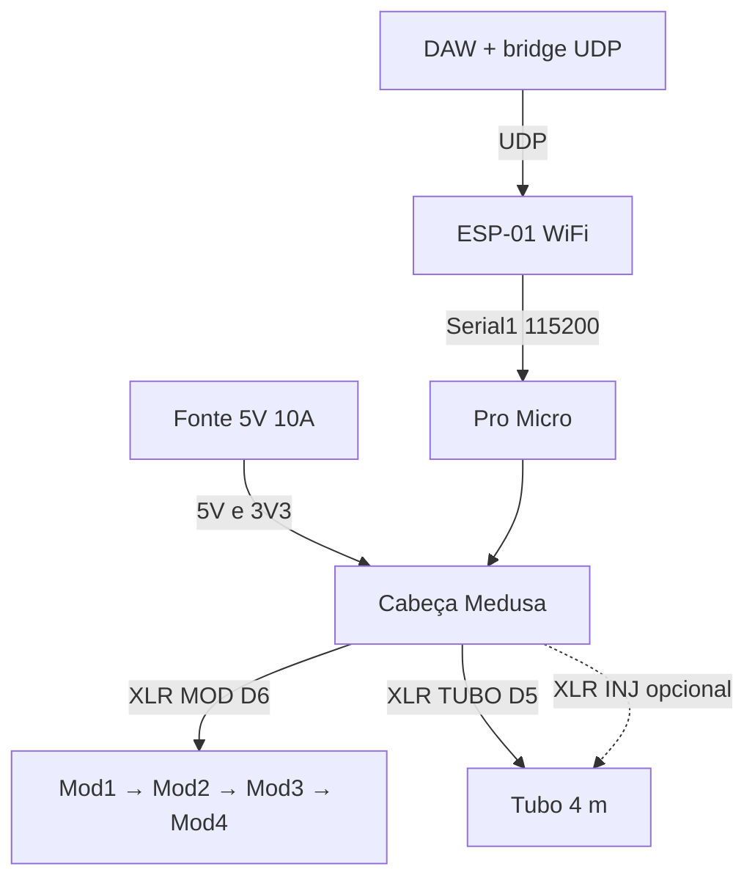

# Cabeça Medusa — Pro Micro + ESP-01

A **Medusa** é a caixa da **cabeça** do StageMod. Dentro da caixa há **apenas**:

| Peça | Função |
|------|--------|
| **Pro Micro** | Pixels (D5/D6), MIDI serial do ESP, upload via USB |
| **ESP-01** | Wi‑Fi → UDP MIDI → UART para o Pro Micro |
| **Passivos / bornes / XLR** | 5V, GND, saídas para módulos e tubo |

Não há outro MCU nem Bluetooth na Medusa — só **Pro Micro + ESP-01**.

## Função

| Entrada | Saídas (tentáculos) |
|---------|---------------------|
| Fonte **5V 10A** (bornes) | **MOD** — DATA D6 + 5V + GND → cadeia dos 4 módulos |
| — | **TUBO** — DATA D5 + 5V + GND → tubo neon |
| — | **INJ** (opcional) — só **5V + GND** → injeção no meio do tubo 4 m |
| **DAW** (Wi‑Fi) | ESP-01 → **Serial1** → Pro Micro (MIDI show) |
| USB micro (Pro Micro) | **Programação** e teste MIDI com cabo (opcional no palco) |

Pinagem XLR: [16-XLR-CONECTORES.md](16-XLR-CONECTORES.md) (1=GND, 2=+5V, 3=DATA).

## Vista geral

```
                    ┌─────────────────────────────────────┐
   [Fonte 5V 10A]──►│  PWR IN (+ / −)                     │
                    │  ┌──────────┐    ┌─────────┐        │
   [DAW Wi‑Fi]──────│  │ ESP-01   │UART│Pro Micro│        │
        UDP         │  │ 3,3 V    ├───►│ Serial1 │        │
                    │  └──────────┘    └────┬────┘        │
                    │         USB (prog.)   │             │
                    │    D6 ──[470Ω]──► XLR MOD           ├──► Mod1…
                    │    D5 ──[470Ω]──► XLR TUBO          ├──► tubo
                    │    5V/GND bus ─────► XLR INJ (opc.) │
                    └─────────────────────────────────────┘
                              CABEÇA MEDUSA
```



Detalhes MIDI sem fio: [18-WIRELESS-MIDI.md](18-WIRELESS-MIDI.md).

## Painel frontal (sugestão)

Caixa ABS **≥ 130×90×45 mm** (ESP + Pro Micro + XLR).

```
┌──────────────────────────────────────────┐
│  STAGEMOD v0     [USB micro]  (antena)  │  ← antena ESP para fora
│                                          │
│   (MOD)  (TUBO)  (INJ)                   │
│     ○      ○       ○      XLR fêmea      │
│                                          │
│  [−]  [+]   bornes fonte 5V              │
└──────────────────────────────────────────┘
```

| Conector | Etiqueta | Pino 3 |
|----------|----------|--------|
| XLR 1 | **MOD** | D6 (via 470Ω) |
| XLR 2 | **TUBO** | D5 (via 470Ω) |
| XLR 3 | **INJ** | **NC** |
| Bornes | **PWR** | Entrada fonte SMPS |
| USB | **PROG** | Pro Micro (não obrigatório no show) |

## Esquema elétrico interno

```
        PWR IN (+) ──┬──[AMS1117-3.3]──► 3V3 ──► ESP-01 (VCC, CH_PD)
                     │                           │
                     ├───────────────────────────┴── VCC Pro Micro (5V)
                     │
                [1000µF]
                     │
        PWR IN (−) ──┴── GND bus ──► ESP GND, Pro Micro GND, shells XLR

        ESP TX (3V3) ──────────────► Pro Micro RX (D0 / Serial1)
        Pro Micro TX (D1) ──[1k/2k]──► ESP RX

        D6 ──[470Ω]──► XLR MOD pin 3
        D5 ──[470Ω]──► XLR TUBO pin 3
        Barramento 5V/GND ──► pinos 1 e 2 de MOD, TUBO, INJ
```

### Regras de montagem

1. **ESP-01 só em 3,3 V**; **CH_PD** em 3,3 V.
2. **TX do Pro Micro** para RX do ESP com divisor (5 V → 3,3 V).
3. Barramento **5V/GND** em **AWG 18** até cada XLR.
4. **Capacitor 1000µF** na entrada 5 V; **100 nF** perto do ESP (opcional).
5. Antena do ESP **fora** de blindagem metálica.
6. Show: `ENABLE_SERIAL_MIDI 1`; USB pode ficar desconectado.

## BOM da Medusa

| Qty | Item | Notas |
|-----|------|--------|
| 1 | Pro Micro 5V 32U4 | Já tem |
| 1 | **ESP-01** (ESP8266) | Firmware [esp01-midi-bridge](../firmware/esp01-midi-bridge/) |
| 1 | **AMS1117-3.3** | 5 V → 3,3 V para ESP |
| 1 | Caixa ABS | XLR + USB + ventilação leve |
| 2–3 | XLR fêmea 3 pinos painel | MOD, TUBO, INJ |
| 1 | Par bornes 2 vias | Entrada fonte |
| 2 | Resistor 470Ω | D5, D6 |
| 2 | Resistor 1k + 2k (ou 10k/20k) | Divisor TX Pro Micro → ESP RX |
| 1 | Capacitor 1000µF 16V | Entrada 5 V |
| 1 | USB micro painel ou pigtail | Upload Pro Micro |
| — | Fio AWG 18 / 22 | Barramento e UART |

## Cabos “tentáculo”

| De | Para | Tipo |
|----|------|------|
| Medusa **MOD** | Módulo 1 **IN** | XLR |
| Módulo 1 **OUT** | … | Até Mod 4 |
| Medusa **TUBO** | XLR do tubo | Palco 3–5 m |
| Medusa **INJ** | Meio do tubo | Só 5V/GND |

## Firmware

| Peça | Sketch |
|------|--------|
| Pro Micro | `promicro-4mod.ino` — `ENABLE_SERIAL_MIDI 1`, baud **115200** |
| ESP-01 | `firmware/esp01-midi-bridge/esp01-midi-bridge.ino` |

| Saída Medusa | `#define` |
|--------------|-----------|
| MOD | `MODULE_PIN` **6** |
| TUBO | `TUBE_PIN` **5** |

## Ordem de montagem

1. Regulador 3,3 V + ESP-01 (testar Wi‑Fi e UDP antes de fechar a caixa).
2. Pro Micro + UART para ESP; upload `promicro-4mod.ino`.
3. Barramento 5 V / GND + capacitor + XLR.
4. Teste MIDI sem fio (um CC) → depois MOD + TUBO.

## Referências

- [18-WIRELESS-MIDI.md](18-WIRELESS-MIDI.md)
- [16-XLR-CONECTORES.md](16-XLR-CONECTORES.md)
- [07-CABLAGEM.md](07-CABLAGEM.md)
- [04-ALIMENTACAO.md](04-ALIMENTACAO.md)
