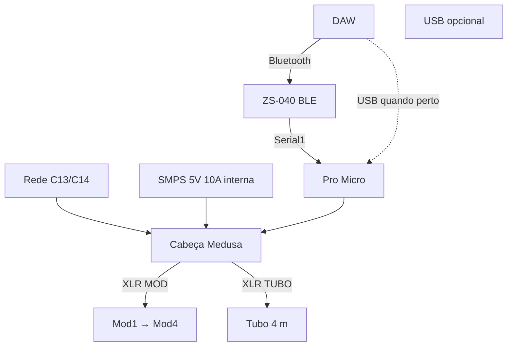

# Cabeça Medusa — Pro Micro + ZS-040

A **Medusa** é a caixa da cabeça do StageMod. Dentro da caixa há **apenas**:

| Peça | Função |
|------|--------|
| **Pro Micro** | Pixels (D5/D6), MIDI **USB** e **Serial1** (ZS-040) |
| **ZS-040** | Bluetooth → UART → Pro Micro |
| **Entrada C14** + **fonte 5 V 10 A** (dentro da caixa) | Rede → DC para o rig |
| **Passivos / XLR** | Barramento 5 V, saídas módulos e tubo |

Não há ESP-01 nem segundo MCU — só **Pro Micro + ZS-040**.

## Dois modos de MIDI (sem trocar firmware)

| Modo | Conexão | Quando |
|------|---------|--------|
| **Sem fio** | DAW → BT → ZS-040 → Serial1 | Palco, cabeça longe do PC |
| **USB** | DAW → USB → Pro Micro | Cabeça perto do notebook; menor latência |

Ambos podem ficar **habilitados** no firmware; na DAW use **só um** caminho por vez.

Detalhes e latência: [18-WIRELESS-MIDI.md](18-WIRELESS-MIDI.md).

## Função

| Entrada | Saídas |
|---------|--------|
| **C14** (cabo C13 “panela”) → SMPS **5 V 10 A** interna | **MOD** — D6 + 5V + GND |
| — | **TUBO** — D5 + 5V + GND |
| — | **INJ** (opc.) — só 5V + GND |
| **DAW** (Bluetooth) | ZS-040 → Serial1 |
| **USB micro** | Pro Micro — programação + MIDI com cabo |

Pinagem XLR: [16-XLR-CONECTORES.md](16-XLR-CONECTORES.md).

## Vista geral

```
[Cabo C13 rede]──► C14 ──► [SMPS 5V 10A dentro da caixa]
                    ┌─────────────────────────────────────┐
                    │  +5V / GND barramento                 │
                    │  ┌──────────┐    ┌─────────┐        │
   [DAW BT]─────────│  │ ZS-040   │UART│Pro Micro│◄──USB (opc.)
                    │  │ (5V*)    ├───►│ Serial1 │        │
                    │  └──────────┘    └────┬────┘        │
                    │    D6 ──[470Ω]──► XLR MOD           ├──► Mod1…
                    │    D5 ──[470Ω]──► XLR TUBO          ├──► tubo
                    │    5V/GND ───────► XLR INJ          │
                    └─────────────────────────────────────┘
                    * VCC 5V se o breakout permitir; senão 3,3 V
```



## Painel

```
┌──────────────────────────────────────────┐
│  [C14]   STAGEMOD v0      [USB micro]    │  ← C14 = entrada rede (cabo C13)
│   (MOD)  (TUBO)  (INJ)                   │
│     ○      ○       ○                     │
└──────────────────────────────────────────┘
```

Furo painel **C14** (IEC 60320): retângulo padrão do conector + 2 parafusos nas orelhas.

## Entrada de rede — conector C14

| Item | Especificação |
|------|----------------|
| Conector painel | **IEC C14** (receptáculo; cabo **C13** na parede) |
| Fonte interna | SMPS **100–240 V AC** → **5 V DC 10 A** (a mesma da BOM) |
| Cabo externo | **C13** macho ↔ tomada (Brasil: 127/220 V conforme rede) |

### Ligação C14 → fonte (lado AC)

Vista **traseira** do C14 (terminals em spade):

| Terminal C14 | Função | → SMPS AC |
|--------------|--------|-----------|
| **Terra** (geralmente **centro** / símbolo ⏚) | PE | **FG / ⏚** da fonte |
| **Fase** | L | **L** (após **fusível** em série, ex. **2 A** retardado) |
| **Neutro** | N | **N** |

Use fio **AWG 18** (ou 1,0 mm²) para AC; **termoretrátil** e **cannotilho**; nenhum condutor exposto na tampa.

**Aviso:** trabalho em **tensão de rede** — desligar na tomada, testar com multímetro e, se não tiver experiência, pedir ajuda a eletricista. A carcaça da caixa **metálica** deve ligar ao **PE** do C14.

### Saída DC (5 V) → barramento

| SMPS DC | Medusa |
|---------|--------|
| **+V** | Barramento 5 V → Pro Micro, ZS-040, pinos 2 dos XLR |
| **−V** | GND comum → Pro Micro, shells XLR, INJ |

```
   [C14] ── L/N/PE ──► [Fusível] ──► SMPS 100-240V
                              │
                         +5V / GND ──┬── Pro Micro
                                      ├── ZS-040
                                      ├── [1000µF]
                                      └── XLR MOD/TUBO/INJ (pinos 1-2)
```

## Esquema elétrico interno (baixa tensão)

```
        +5V ──┬──► VCC Pro Micro
              ├──► VCC ZS-040 (5V ou 3V3 via AMS1117)
              ├──► XLR pin 2 (MOD, TUBO, INJ)
              └── [1000µF] ── GND

        GND ──┴── shells XLR, Pro Micro, SMPS −V

        ZS TX ───────────────► Pro Micro RX (D0 / Serial1)
        Pro Micro TX (D1) ───► ZS RX  (divisor se 3V3)

        D6/D5 ──[470Ω]──► XLR MOD / TUBO pin 3
```

## BOM da Medusa

| Qty | Item | Notas |
|-----|------|--------|
| 1 | Pro Micro 5V 32U4 | Já tem |
| 1 | **ZS-040** (BLE UART) | Breakout com **entrada 5 V** de preferência |
| 0–1 | AMS1117-3.3 | Só se o seu ZS-040 for **3,3 V** estrito |
| 1 | **C14** painel (IEC 60320) | Entrada rede + cabo C13 |
| 1 | SMPS **5 V 10 A** 100–240 V | **Dentro** da Medusa |
| 1 | Fusível **2 A** + suporte | Série na fase (L) |
| 1 | Cabo C13 1,5 m (ou usar existente) | Tomada → Medusa |
| 1 | Caixa ABS grande | C14 + SMPS + USB + XLR |
| 2–3 | XLR fêmea painel | MOD, TUBO, INJ |
| 2 | 470 Ω | Saídas **D5** e **D6** → XLR (além do 470 Ω **em cada módulo**) |
| 1 | 1000 µF 16 V | Barramento 5 V na Medusa (além do cap **em cada módulo**) |
| 1 | USB micro painel | Pro Micro |
| — | Divisor 1k/2k | TX Pro Micro → RX ZS (se necessário) |

## Firmware

| Peça | Onde |
|------|------|
| Pro Micro | `promicro-4mod.ino` — `ENABLE_USB_MIDI 1`, `ENABLE_SERIAL_MIDI 1` |
| ZS-040 | Transparente; configurar **AT+BAUD4** (115200) uma vez |

## Ordem de montagem

1. ZS-040 em adaptador USB: testar `AT`, subir baud, parear no PC.
2. Soldar UART ao Pro Micro; upload firmware.
3. **C14 + SMPS** (AC só com caixa fechada após teste de isolamento); barramento 5 V + XLR.
4. Teste MOD com **BT** e depois com **USB**.

## Referências

- [18-WIRELESS-MIDI.md](18-WIRELESS-MIDI.md)
- [16-XLR-CONECTORES.md](16-XLR-CONECTORES.md)
- [07-CABLAGEM.md](07-CABLAGEM.md)
