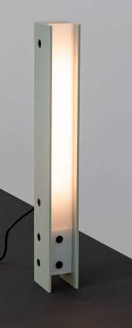

# Módulo spot — design 3D (impressão + montagem)

Corpo inspirado na **coluna vertical** de referência: perfil em **U**, **difusor branco recuado** na frente, **pés** nas laterais e **parafusos aparentes** (M3) na lateral e na base do difusor.

| Item | Valor padrão (CAD) |
|------|---------------------|
| Altura total | **300 mm** |
| Largura frontal | **48 mm** |
| Profundidade | **34 mm** |
| LEDs | **8× WS2812B** em coluna (pitch **10 mm** ajustável no `.scad`) |
| Conectores | **2× XLR** na tampa inferior (IN ≈ 25% largura, OUT ≈ 75%) |

Arquivos: [`hardware/spot-module-v0/`](../hardware/spot-module-v0/).

---

## Peças impressas (×4 módulos)

| STL | Qtd/módulo | Função |
|-----|------------|--------|
| `spot_body.stl` | 1 | Carcaça U + pés + calço para PCB |
| `spot_diffuser.stl` | 1 | Painel difusor frontal |
| `spot_bottom_plate.stl` | 1 | Base com furos XLR |
| `spot_led_clip.stl` | 0–2 | Opcional se a fita não encaixar no calço |

Hardware de montagem (por módulo, típico):

| Item | Qtd |
|------|-----|
| Parafuso M3 × 10 | 4 (tampa) + 2–4 (difusor) |
| Porca M3 ou insert térmico M3 | conforme furo |
| XLR fêmea painel (IN) | 1 |
| XLR macho painel (OUT) | 1 |

---

## Fluxo de montagem mecânica

```
1. Imprimir corpo + difusor + tampa
2. Soldar 8 LEDs + fios nos XLR (ver manual elétrico)
3. Parafusar XLR na tampa inferior; passar cabos pelo furo central
4. Fixar tampa no corpo (M3 nos 4 cantos)
5. Encaixar PCB no calço traseiro; fios pela canaleta
6. Deslizar difusor no slot frontal; parafusar na base (e opcionalmente lateral)
7. Etiqueta MOD 1…4 na parte de trás
```

Ordem elétrica e testes: [22-MANUAL-MONTAGEM.md](22-MANUAL-MONTAGEM.md) §4 e §9.

---

## Ajustar ao seu LED

Abra `hardware/spot-module-v0/stagemod_spot_v0.scad` e altere:

| Variável | Quando mudar |
|----------|----------------|
| `led_pitch` | Fita 60 LED/m → ~16,7 mm; 100 LED/m → ~10 mm |
| `led_pcb_w` | Largura do breakout (muitos usam 10 mm) |
| `led_count` | Manter **8** no StageMod v0 |
| `xlr_hole_d` | Medir o recorte do conector (muitos painéis ≈ 22–24 mm) |

Depois rode `./export-stl.sh` e reimprima só a peça afetada (geralmente corpo ou difusor).

---

## Impressão 3D

| Parâmetro | Corpo / tampa | Difusor |
|-----------|---------------|---------|
| Material | PETG (palco) ou PLA (prototipo) | PETG branco / PLA branco |
| Camada | 0,2 mm | 0,12–0,2 mm |
| Infill | 15–25% | 100% ou 6+ paredes |
| Suportes | Só se inclinar; preferir corpo **costas na mesa** | Não |
| Pós-processo | Lixar encaixe do difusor se apertado | Lixar faces internas para mais difusão |

**Difusor:** se a luz mostrar “pontos” dos LEDs, use filme difusor adesivo por dentro ou aumente a espessura (`diffuser_thick` no SCAD).

---

## Vista explodida (conceito)

```
        ┌─────────────┐
        │  difusor    │  ← recuado ~4,5 mm
        ├─────────────┤
        │ 8× LED      │  ← calço traseiro
        │   coluna    │
        │  (U-body)   │
        └──────┬──────┘
          pés  │  pés
        ┌──────┴──────┐
        │ bottom_plate│  ← XLR IN | XLR OUT
        └─────────────┘
```

---

## Referência visual



A geometria segue esta coluna (U + difusor recuado + pés). Fotos da sua montagem podem ir em `hardware/spot-module-v0/photos/`.

---

## Próximos passos (opcional)

- Versão com **encaixe magnético** na tampa para manutenção  
- **STEP** exportado do OpenSCAD para edição no FreeCAD  
- Variante **mais baixa** (~220 mm) para transporte
